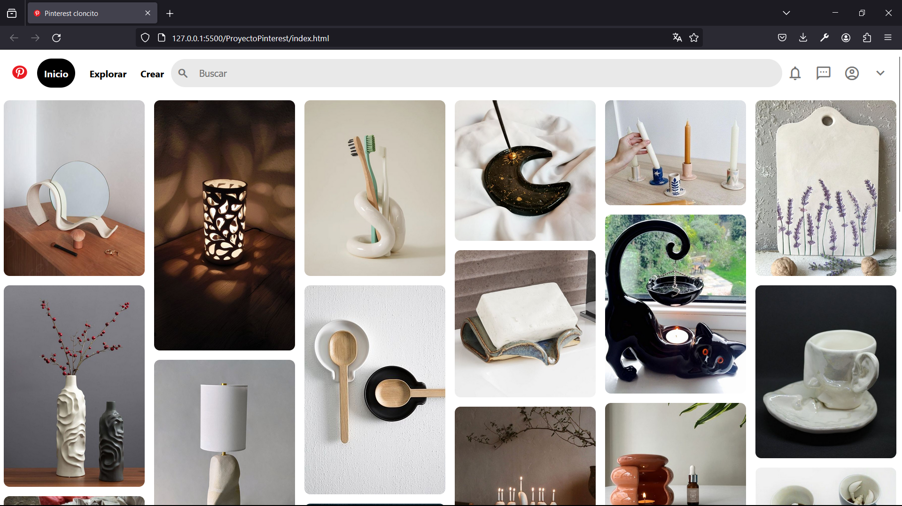

# Clon de Pinterest
Este proyecto es un clon de la interfaz de usuario de Pinterest, creado únicamente con HTML5 y CSS.

Se enfoca en replicar la apariencia visual de Pinterest, ofreciendo una experiencia de navegación similar con un diseño responsive y funcionalidades básicas. 

### Características

* **Diseño Responsive:** Adaptable a diferentes tipos de tamaños de pantalla para una experiencia de usuario óptima en dispositivos móviles y de escritorio.

* **Interfaz de Usuario Intuitiva:** Inspirada en Pinterest, con una navegacipon fácil y accesible.

* **Interacciones dinámicas:** Efectos visuales para elementos interactivos como botones y enlaces.  

* **Iconografía y estilos modernos:** Uso de la biblioteca de íconos de Material Design y estilos CSS modernos para una apariencia vigente.

### Tecnologías Utilizadas

* **HTML5:** Para la estructura básica del sitio.
* **CSS3:** PAra el diseño y el estilo, incluyendo _flexbox_ para un diseño responsivo y efectos de _hover_.
* **Google Fonts:** Para fuentes personalizadas.

### Vista Previa del Proyecto

### Contacto 
Si te gustaría invitarme a colaborar en un proyecto, contáctame.

[LinkedIn](https://linkedin.com/in/imstephtp)

[Twitter](https://twitter.com/imstephtp)

Este proyecto fue realizado en el bootcamp enfocado en Desarrollo Web Front End de Tecnolochicas. 

 
